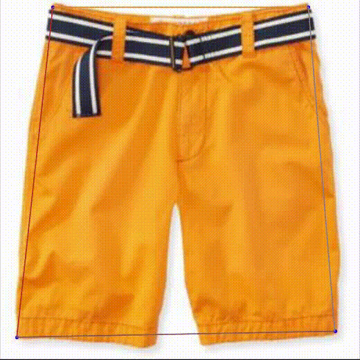

## LANDMARK LOCALIZATION FOR A FASHION DATASET: A PIFPAF PLUGIN

This repository is the code for [*Category classification and landmark localization for a fashion dataset*](https://drive.google.com/drive/folders/1jqvd6CmmyKQaodJAdwPNVwH92M9YC9tg?usp=sharing).
The project is a part of an internship I did at VITA Lab, EPFL.




The above is a short illustration of predictions made by one of the trained models. The numbers shown on the second image of each pair are the normalized errors.


### -Requirements for converting deepfashion to a coco style dataset

First of all, download deepfashion-c (category classification and attribute prediction) dataset from [dedicated drive](https://drive.google.com/drive/folders/0B7EVK8r0v71pQ2FuZ0k0QnhBQnc?resourcekey=0-NWldFxSChFuCpK4nzAIGsg). In our training we used low resolution images. Create a folder for all the dataset files and put in it:

1. unzipped img folder
2. an Eval folder containing list_eval_partition.txt
3. an Anno folder containing list_landmarks.txt and list_bbox.txt from Anno_coarse

The next step is to change the running script `convert_coco_separate/convert_separate.sh` (in case you are running the code on a cluster); change *--dataset-root* to the path of the folder you created for dataset and *--root-save* to the path of the folder where you want to save your coco style converted deepfashion. At the end, you will have three folders and three json files that correspond to different subsets of the dataset (train, eval, and test).

### -Requirements for training

Python 3,  openpifpaf (tested with version 0.13.4):

```
pip3 install openpifpaf
```

Find a FAQ page and other useful information at [Openpifpaf guide](https://openpifpaf.github.io/intro.html).

to train the model you can use a similar script to `shufflenetv2k16_scratch_0001.sh`. However, you should either indicate the path to dataset either in the script, either directly in the code `openpifpaf_deepfashion/deepfashion_datamodule`.

### -Requirements for evaluation

Your trained model should be in `outputs` folder in the main directory (same level as the script used for training). 
To evaluate, change the script `evaluation/shufflenetv2k16_scratch_evaluation.sh` accordingly to the path of your model. You can also have tensorboard logs if not using `single_epoch` option and changing other parameters in the script accordingly.

One example of such curves can be found [here](https://wandb.ai/pekhpekhpekh/uncategorized/runs/9ar9kssd/overview?workspace=user-pekhpekhpekh).


